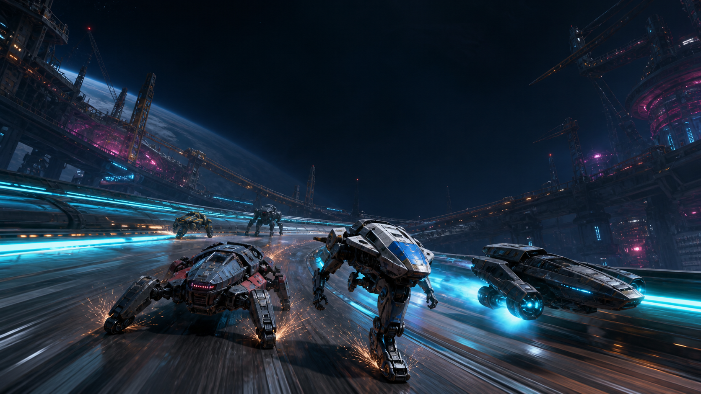

# MECHA OVERDRIVE — Circuit Zero

**Course-combat de méchas livrée sous deux éditions complémentaires : Godot 3D est la branche principale ; l’édition web autonome reste jouable et déployable séparément.**



Le visuel de présentation est une création originale générée avec OpenAI pour ce projet. Sa provenance est documentée dans [`docs/ASSET_PROVENANCE.md`](docs/ASSET_PROVENANCE.md).

## Les deux éditions

| Édition | Emplacement | Contenu | Exécution |
|---|---|---|---|
| **Godot 3D — principale** | `godot/` | 10 châssis, 4 modes, 4 circuits, garage, codex, progression et sauvegarde v2 | Godot **4.7.2** |
| **Web — compagnon autonome** | racine du dépôt | 8 châssis, Course rapide, Grand Prix et Contre-la-montre, PWA hors ligne | Navigateur moderne, Node.js facultatif |

La version déclarée dans le projet Godot est `2.0.0`. Les résultats de validation réellement exécutés sont consignés dans [`docs/QA_REPORT.md`](docs/QA_REPORT.md) ; la présence d’un test dans le dépôt ne vaut pas, à elle seule, validation de release.

## Lancer l’édition Godot 3D

### Depuis l’éditeur

1. Installer **Godot 4.7.2** standard.
2. Dans le gestionnaire de projets, choisir **Importer**.
3. Sélectionner `godot/project.godot`.
4. Ouvrir le projet puis lancer la scène principale avec `F6`/`F5` selon le contexte, ou le projet avec `F5`.

La scène de démarrage configurée est `res://scenes/app.tscn`. Le renderer utilise le mode **GL Compatibility**, adapté à une plage matérielle large.

### Depuis un terminal

Si l’exécutable est disponible sous le nom `godot` :

```bash
godot --editor --path godot
godot --path godot
```

Sous Windows, remplacez `godot` par le chemin de `Godot_v4.7.2-stable_win64.exe` ou de sa variante console.

## Contenu Godot 3D

### Dix architectures jouables

| Architecture | Mécha | Identité de pilotage |
|---|---|---|
| Bipède | **Raptor R2** | polyvalence et gyro-correction après impact |
| Tripode | **Triarch T3** | stabilité et ancrage vectoriel |
| Quadrupède | **Fenrir Q4** | accélération et reprise prédatrice |
| Hexapode | **Mantis H6** | précision technique et hors-piste |
| Octopode | **Arachne O8** | masse, blindage et bélier |
| Aéroglisseur | **Wraith V0** | vitesse, terrain meuble et mines au sol |
| Chenilles | **Bastion C2** | couple, blindage et franchissement |
| Monoroue | **Cyclops M1** | dérive gyroscopique et refroidissement |
| Sphère | **Orb S7** | inertie omnidirectionnelle et rebond |
| Myriapode | **Centurion S12** | douze appuis, adhérence et motricité |

### Quatre modes

- **Course rapide** (`quick`) : grille complète, objets et classement.
- **Contre-la-montre** (`time_trial`) : un pilote, sans objets.
- **Élimination** (`elimination`) : le dernier concurrent est éliminé à intervalle régulier.
- **Grand Prix** (`grand_prix`) : championnat en quatre manches avec points cumulés.

### Quatre circuits

- **Fonderie Néon** — Nexus Industriel 7 ;
- **Faille Écarlate** — Désert de Vermillon ;
- **Arc Polaire** — lune cryo Khepri ;
- **Cimetière Orbital** — anneau de Morrigan.

Les circuits sont assemblés en 3D par `TrackFactory` à partir des spécifications de la base de données. Les dix silhouettes sont générées par `MechaFactory`, sans dépendance à des modèles 3D externes.

### Combat et progression

La branche Godot contient huit objets : missile ion, EMP, bouclier phase, cellule Overdrive, mine gravitique, drone réparateur, onde cinétique et Railburst. Le garage expose les peintures et quatre familles d’améliorations : moteur, servomoteurs, refroidissement et blindage.

## Contrôles Godot

| Action | Clavier | Manette |
|---|---|---|
| Accélérer | `Z`, `W` ou `↑` | gâchette haute droite / `RB` |
| Freiner | `S` ou `↓` | gâchette haute gauche / `LB` |
| Diriger | `Q`/`D`, `A`/`D` ou `←`/`→` | stick gauche |
| Dérive | `Ctrl` ou `C` | `B` |
| Surcharge | `Maj` ou `X` | `X` |
| Utiliser l’objet | `Espace`, `E` ou `Entrée` | `A` |
| Recaler le mécha | `R` | — |
| Pause | `Échap` ou `P` | `Start` |

Le menu et les écrans garage, codex et résultats acceptent aussi les actions d’interface standard de Godot.

## Sauvegarde Godot v2

Le service autoloadé `SaveSystem` écrit un profil JSON versionné dans :

```text
user://mecha_overdrive_profile.json
```

La sauvegarde v2 conserve notamment :

- nom du pilote, crédits et châssis actif ;
- peintures et niveaux d’amélioration par châssis ;
- records par circuit et mode ;
- statistiques de carrière ;
- accessibilité et volumes audio.

Les données sont normalisées à la lecture. L’écriture passe par un fichier temporaire puis une sauvegarde de secours ; un fichier illisible est archivé avant reconstruction d’un profil sain. Un abandon ou DNF compte comme course, mais ne peut accorder ni crédits ni record.

## Contrôle qualité

### Agrégat structurel et web

Node.js 18 ou plus récent suffit ; le projet n’a aucune dépendance npm d’exécution.

```bash
npm run qa
```

Cette commande exécute la QA web (`npm test`) puis le validateur structurel Godot (`tools/validate-godot.mjs`). Elle ne remplace pas le parseur ni le runtime Godot.

### Import et smoke test Godot

```bash
godot --headless --path godot --editor --quit
godot --headless --path godot --script res://tests/smoke_test.gd
godot --headless --path godot --script res://tests/runtime_flow_test.gd
```

Le premier passage force l’import et le parse des ressources. Le smoke vérifie le catalogue, la sauvegarde et la simulation déterministe. Le flux runtime traverse la vraie application du menu à une course 3D, puis aux résultats et au retour menu, sans modifier la sauvegarde du joueur.

## Édition web autonome

L’édition web reste à la racine du dépôt. Elle propose huit architectures, quatre circuits, trois modes, huit objets, une IA à sept rivaux, un garage persistant, les commandes clavier/manette/tactile et une PWA hors ligne après la première ouverture via HTTP/HTTPS.

### Lancement web

Sous Windows, `LANCER_JEU.bat` démarre un serveur local. Sous macOS/Linux :

```bash
chmod +x LANCER_JEU.sh
./LANCER_JEU.sh
```

Ou directement avec Node.js :

```bash
npm start
```

L’adresse par défaut est `http://127.0.0.1:8080/index.html`. `index.html` peut aussi être ouvert directement, mais le service worker exige HTTP/HTTPS.

La sauvegarde web est indépendante de celle de Godot et reste dans le `localStorage` du navigateur sous la clé `mecha_overdrive_circuit_zero_save_v1`.

### Contrôles web

| Action | Clavier | Manette | Tactile |
|---|---|---|---|
| Accélérer | `Z`, `W` ou `↑` | gâchette droite | GAZ |
| Freiner | `S` ou `↓` | gâchette gauche | FREIN |
| Diriger | `Q`/`D`, `A`/`D` ou `←`/`→` | stick gauche | gauche / droite |
| Surcharge | `Maj` ou `X` | `X` | BOOST |
| Dérive | `Ctrl` ou `C` | `B` | DRIFT |
| Objet | `Espace`, `E` ou `Entrée` | `A` | OBJET |
| Recalage | `R` | View | RESET |
| Pause | `Échap` ou `P` | Menu | PAUSE |

## Structure du dépôt

```text
MECHA_OVERDRIVE/
├── godot/                         édition principale Godot 3D
│   ├── project.godot
│   ├── scenes/                    app, menu, garage, codex, résultats
│   ├── scripts/                   données, systèmes, course, UI, audio
│   ├── assets/                    key art original intégré
│   └── tests/
│       ├── smoke_test.gd          contrat déterministe headless
│       └── runtime_flow_test.gd   flux menu/course/résultats headless
├── index.html                     édition web Canvas pseudo-3D
├── js/                            moteur, données, rendu et UI web
├── tests/                         QA Node et parcours navigateur web
├── tools/                         serveurs et validateurs
├── media/                         visuels web et key art
├── docs/                          conception, architecture, QA et provenance
├── manifest.webmanifest           manifeste PWA
├── service-worker.js              cache hors ligne web
└── vercel.json                    déploiement statique de l’édition web
```

## Documentation

- [`godot/README.md`](godot/README.md) — démarrage, contrôles et smoke test Godot.
- [`docs/ARCHITECTURE_TECHNIQUE.md`](docs/ARCHITECTURE_TECHNIQUE.md) — architecture des deux éditions.
- [`docs/QA_REPORT.md`](docs/QA_REPORT.md) — gates de release et résultats confirmés.
- [`docs/GAME_DESIGN_DOCUMENT.md`](docs/GAME_DESIGN_DOCUMENT.md) — vision, modes et équilibrage historique.
- [`docs/LORE.md`](docs/LORE.md) — univers, pilotes et circuits.
- [`docs/ASSET_PROVENANCE.md`](docs/ASSET_PROVENANCE.md) — origine des assets créés pour le projet.
- [`docs/ROADMAP.md`](docs/ROADMAP.md) — pistes d’évolution.

## Publication

Vercel héberge l’édition web statique de la racine. La branche Godot reste le projet source principal à ouvrir dans Godot 4.7.2 ; un export jouable Godot doit faire l’objet d’un gate d’export séparé avant d’être annoncé comme livrable binaire.

## Licence

Le dépôt est `UNLICENSED` et attribué à **Darknigthmare**. Aucun asset provenant des franchises ou jeux cités comme inspirations de genre n’est inclus.

---

Conception initiale : **Darknigthmare**
Édition principale : **Godot 4.7.2 / GDScript / 3D procédurale**
Édition compagnon : **HTML5 / CSS / Canvas 2D / JavaScript / Web Audio / PWA**
