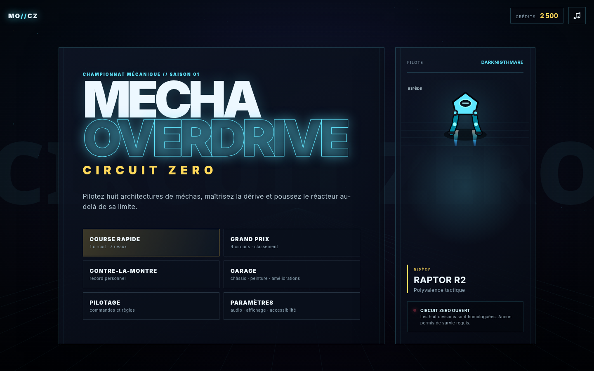
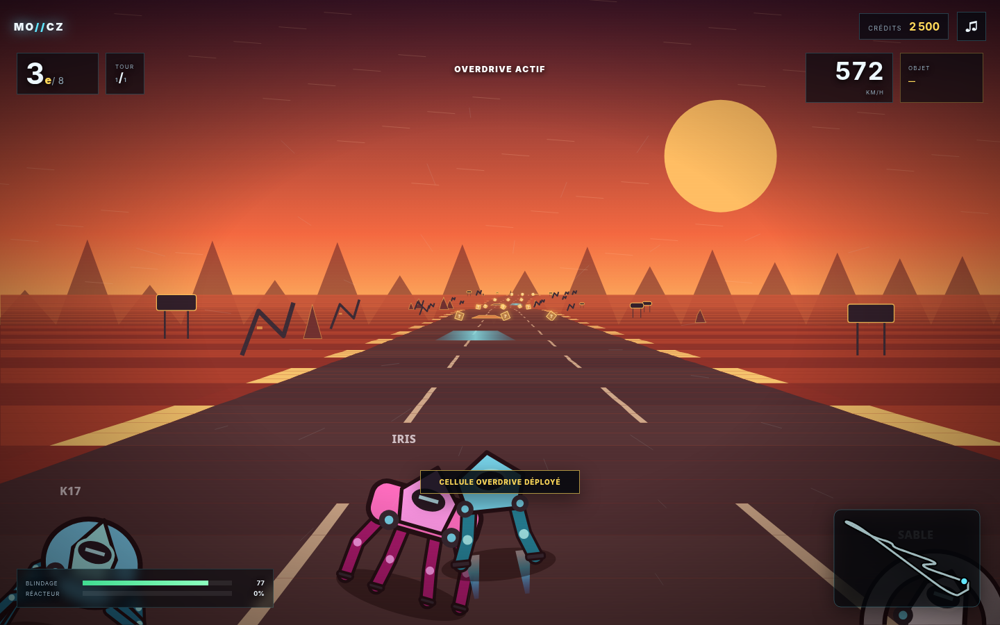

# MECHA OVERDRIVE — Circuit Zero

**Jeu de course-combat de méchas pseudo‑3D, autonome et jouable dans un navigateur.**

Circuit Zero oppose huit architectures mécaniques radicalement différentes sur des pistes à haute vitesse. Le pilotage associe trajectoires, dérive, surcharge thermique, collisions par masse, objets tactiques, dégâts, reconstruction et progression de garage.





## Contenu de la version 1.0.0

- **8 catégories jouables** : bipède, tripode, quadrupède, hexapode, octopode, aéroglisseur, chenilles et monopode à roue.
- **4 circuits complets** : Fonderie Néon, Faille Écarlate, Arc Polaire et Cimetière Orbital.
- **3 modes** : Course rapide, Grand Prix en quatre manches et Contre‑la‑montre.
- **8 objets** : missile ion, EMP, bouclier, Overdrive, mine gravitique, drone réparateur, onde cinétique et Railburst.
- **Pilotage différencié** : vitesse, accélération, adhérence, masse, blindage, stabilité, chauffe et comportement hors‑piste propres à chaque architecture.
- **Systèmes de course complets** : compte à rebours, tours, positions, meilleur tour, mini‑carte, pause, arrivée, classement et récompenses.
- **Combat arcade** : projectiles, mines, effets de zone, boucliers, dégâts, destruction temporaire et reconstruction protégée.
- **IA à sept rivaux** : anticipation des virages, choix de voie, évitement, usage contextuel des objets et trois difficultés.
- **Garage persistant** : choix du châssis, huit peintures, quatre branches d’amélioration et crédits gagnés en course.
- **Clavier, manette et tactile** : interface adaptative avec réglages de qualité, contraste et réduction des mouvements.
- **PWA hors ligne** après une première ouverture via HTTP/HTTPS.
- **Aucune dépendance d’exécution ni ressource distante** : graphismes et audio sont générés par le projet.

## Lancer le jeu

### Windows

Double‑cliquer sur **`LANCER_JEU.bat`**. Le lanceur utilise Node.js lorsqu’il est disponible, puis Python 3 en secours, démarre le serveur local et ouvre le jeu.

### macOS / Linux

```bash
chmod +x LANCER_JEU.sh
./LANCER_JEU.sh
```

L’adresse de départ est `http://127.0.0.1:8080/index.html`. Si ce port est occupé, le lanceur sélectionne automatiquement le suivant et ouvre la bonne adresse.

### Avec Node.js

Node.js 18 ou plus récent suffit ; aucune commande `npm install` n’est nécessaire.

```bash
npm start
```

### Avec Python 3

```bash
python3 tools/serve.py
```

### Ouverture directe

`index.html` peut être ouvert directement. Le jeu reste jouable, mais l’installation PWA et le cache hors ligne nécessitent un serveur local ou un hébergement HTTPS.

## Commandes

| Action | Clavier | Manette | Tactile |
|---|---|---|---|
| Accélérer | `Z`, `W` ou `↑` | gâchette droite / `A` | GAZ |
| Freiner | `S` ou `↓` | gâchette gauche | FREIN |
| Diriger | `Q`/`D`, `A`/`D` ou `←`/`→` | stick gauche | ◀ / ▶ |
| Surcharge réacteur | `Maj` ou `X` | `X` | BOOST |
| Dérive | `Ctrl` ou `C` | `B` | — |
| Utiliser l’objet | `Espace`, `E` ou `Entrée` | `A` | OBJET |
| Recaler le mécha | `R` | bouton View | — |
| Pause | `Échap` ou `P` | bouton Menu | — |

Maintenir la surcharge augmente fortement les performances mais remplit la jauge thermique. À 100 %, le réacteur se verrouille temporairement. Une dérive suffisamment longue déclenche un mini‑boost à la sortie du virage.

## Les huit architectures

| Division | Mécha | Spécialité et aptitude |
|---|---|---|
| Bipède | **Raptor R2** | polyvalence et correction après impact |
| Tripode | **Triarch T3** | stabilité et résistance aux chocs/ondes |
| Quadrupède | **Fenrir Q4** | accélération et reprise après erreur |
| Hexapode | **Mantis H6** | maniabilité technique et hors‑piste |
| Octopode | **Arachne O8** | blindage, masse et collisions offensives |
| Aéroglisseur | **Wraith V0** | vitesse pure et immunité aux mines au sol |
| Chenilles | **Bastion C2** | couple, blindage et franchissement du sable/débris |
| Monopode à roue | **Cyclops M1** | dérive gyroscopique et refroidissement actif |

## Progression et sauvegarde

La progression est enregistrée automatiquement dans le `localStorage` du navigateur sous la clé `mecha_overdrive_circuit_zero_save_v1` :

- crédits et statistiques de carrière ;
- châssis actif et peintures ;
- niveaux des quatre améliorations par châssis ;
- meilleurs temps par circuit ;
- réglages audio, affichage, accessibilité et tactile.

Le menu **Paramètres** permet de réinitialiser entièrement la sauvegarde.

## Tests et contrôle qualité

```bash
npm test               # contrôle complet sans navigateur
npm run test:browser   # parcours Chromium bureau facultatif avec Playwright
npm run test:flow      # flux complets bureau + tactile mobile
```

La livraison comprend :

- **10/10 tests moteur** ;
- **21 contrôles d’intégration** ;
- **73 contrôles de structure, données, cache et assets** ;
- validation syntaxique récursive de tous les fichiers JavaScript/MJS ;
- scénario Chromium complet sans erreur ni avertissement console ;
- parcours Course rapide, Contre‑la‑montre, garage et Grand Prix quatre manches ;
- interface tactile en paysage.

Le rapport détaillé se trouve dans [`docs/QA_REPORT.md`](docs/QA_REPORT.md).

## Structure du projet

```text
MECHA_OVERDRIVE/
├── index.html                    écrans, HUD et Canvas
├── styles.css                    direction artistique et responsive
├── js/
│   ├── core.js                   utilitaires, RNG et événements
│   ├── data.js                   contenu et équilibrage
│   ├── storage.js                sauvegarde et progression
│   ├── audio.js                  synthèse Web Audio
│   ├── input.js                  clavier, manette et tactile
│   ├── track.js                  génération des circuits
│   ├── renderer.js               rendu pseudo‑3D procédural
│   ├── game.js                   physique, IA, combat et modes
│   ├── ui.js                     menus, garage, HUD et résultats
│   └── main.js                   assemblage et boucle principale
├── media/                        icône et captures du jeu
├── tests/                        tests moteur, intégration et Chromium
├── tools/                        serveurs locaux et validation
├── docs/                         GDD, lore, architecture, QA et roadmap
├── manifest.webmanifest          installation PWA
├── service-worker.js             cache hors ligne
└── vercel.json                   configuration de déploiement statique
```

## Documentation

- [`docs/GAME_DESIGN_DOCUMENT.md`](docs/GAME_DESIGN_DOCUMENT.md) — vision, modes, pilotage, contenu et équilibrage.
- [`docs/LORE.md`](docs/LORE.md) — univers, championnat, pilotes et circuits.
- [`docs/ARCHITECTURE_TECHNIQUE.md`](docs/ARCHITECTURE_TECHNIQUE.md) — modules, données, rendu, sauvegarde et extension.
- [`docs/QA_REPORT.md`](docs/QA_REPORT.md) — matrice de tests et résultats.
- [`docs/ROADMAP.md`](docs/ROADMAP.md) — évolutions possibles après la version 1.0.
- [`CHANGELOG.md`](CHANGELOG.md), [`CREDITS.md`](CREDITS.md) et [`NOTICE.md`](NOTICE.md) — version, provenance et publication.

## Publication

Le dossier est statique et peut être envoyé tel quel sur GitHub Pages, Vercel, Netlify ou tout hébergement HTTPS. Aucune compilation n’est nécessaire. Les chemins étant relatifs, le jeu peut également être publié dans un sous‑répertoire.

## Licence

Cette livraison est protégée par défaut comme une archive privée attribuée à **Darknigthmare** (`UNLICENSED`). Aucune licence publique de redistribution n’est imposée. Le propriétaire peut remplacer `LICENSE` par la licence propriétaire, commerciale ou open source de son choix avant publication. Aucun asset provenant des licences citées comme inspirations de genre n’est inclus.

---

**Version 1.0.0 — Circuit Zero**  
Conception initiale : **Darknigthmare**  
Technologies : HTML5, CSS, Canvas 2D, JavaScript, Web Audio et PWA.
